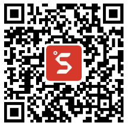
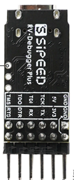
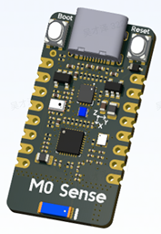

# 矽速2022秋招AIoT挑战赛
矽速(Sipeed)2022秋招**AIoT挑战赛**，**万元大奖**等你来拿～   
赛题信息：https://github.com/sipeed/sipeed2022_autumn_competition  
转发比赛信息(此截图)到1000人以上相关技术QQ群 且为 github.com/sipeed/TinyMaix 点Star  
即可到矽速官方店领取 BL702 JTAG+UART调试小板一块 或 新款BL702 TinyML开发板一块～  
（每github ID仅送一个,非矽速自营群,不能恶意重复转发,截图给客服, sipeed.taobao.com） 

 ___   
(BL702 JTAG+UART调试小板 有现货， BL702 TinyML开发板 十月份发货)

## 竞赛简介
值此2022秋招之际，你是否想体验下AIoT行业的工作内容和机会？  
快来围观/参加 矽速(Sipeed)2022秋招AIoT挑战赛吧，以题会友，万元大奖等你来拿～  
矽速科技专注于做AIoT/tinyML的软硬件开发平台和社区生态，推进AI边缘计算的商业落地。  
举办本次挑战赛旨以一个精致小赛题的形式让社区开发者和大学生了解AIoT行业的实际工作内容和难度，挑战自身的算法或者编码能力。  

本次挑战赛分为 软件组 和 硬件组，每组又分为若干小方向，你可以选择与自己相符的赛题参与。   
比赛时间 2022年9～10月份，请在10.31前按要求提交工程或者PR.

## 竞赛奖励
**所有组别** 赛题完赛者均可获得矽速优先面试通道 及 新产品板卡一份：  
C906 480M + E907 320M 双核异构AIoT板卡，内置64M DDR + NPU， 含 2MP 摄像头 + 电容触摸屏。

**软件组系统题** 完赛者将额外获得高性能四核RISC-V Pad一台！（性能秒RPi4） 

**软件组优化题** 赛题前三名并且确定入职的将获得对应奖金～（不入职的奖金减半）  
（具体要求详见赛题内容，若参赛人数不足或者未达到最低要求则可能轮空）  
第1名，奖金**10000**元人民币  
第2名，奖金**4000**元人民币  
第3名，奖金**2000**元人民币  

**硬件组设计题** 赛题前三名并且确定入职的将获得对应奖金～（不入职的奖金减半）  
（具体要求详见赛题内容，若参赛人数不足或者未达到最低要求则可能轮空）  
第1名，奖金**5000**元人民币  
第2名，奖金**2000**元人民币  
第3名，奖金**1000**元人民币  

同时参加多个组别的，最终仅颁发奖励较高组别的奖励。

## 赛题内容
具体赛题内容和评比方式详见以下页面，本次比赛最终解释权归矽速科技所有。  

软件组 初级题：[TinyMaix初体验](sw_beginner.md)  
软件组 优化题：[TinyMaix卷王争霸赛](sw_opt.md)  
软件组 系统题：[跨界AIoT芯片主线化](sw_linux.md)  
硬件组 设计题：[跨界AIoT模组创新设计](hw_design.md)    

## 快速通道
考虑到在职工程师的空闲时间可能不多，以及大佬一眼就知道该怎么做不想浪费时间，所以我们也同时提供快速通道。  
查看上述赛题，觉得自己能力匹配的，可以直接投递简历到 support@sipeed.com ，当然邮件中附上你对赛题的解题思路会有加分。  
除了软硬件工程师外，FAE/设计师/文档/运营也可以直接投递简历至 support@sipeed.com～  

## 比赛结果
**软件组初级题**  

**软件组优化题**  

**软件组系统题**  

**硬件组设计题**  

## 交流qq群
247399032  

