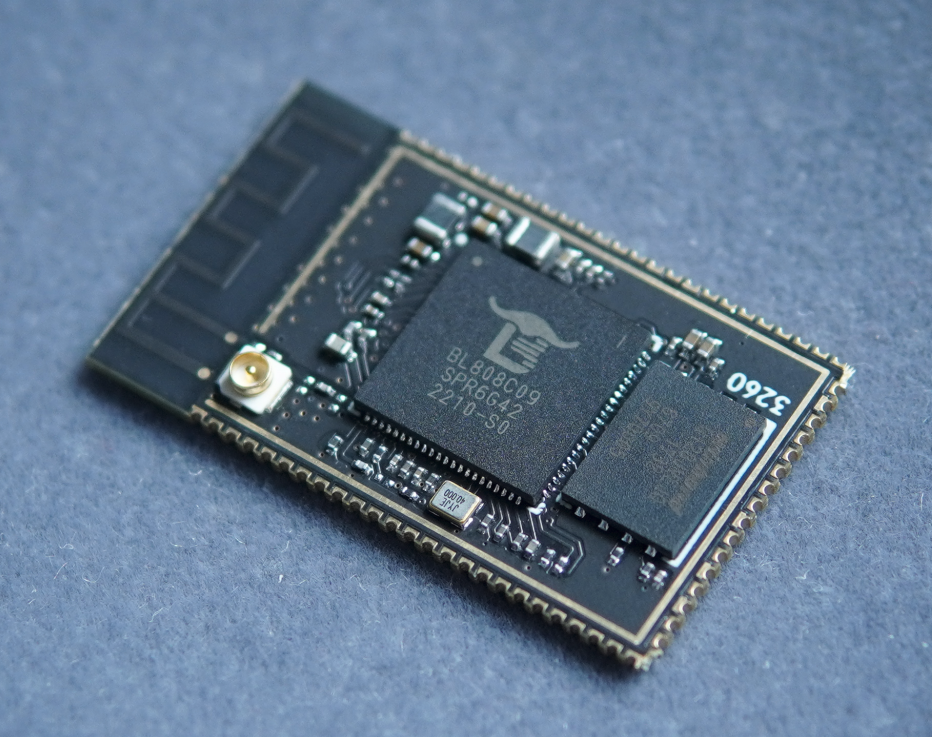
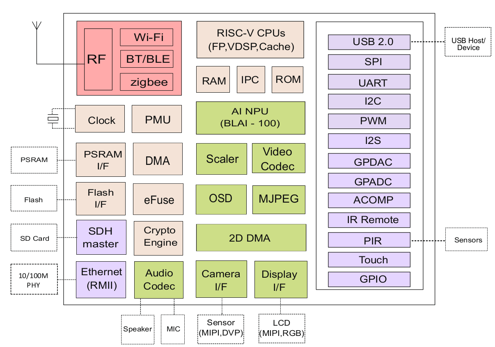

# 硬件设计题
跨界AIoT模组创新设计

## 题目描述   
执此金秋佳节，Sipeed即将发布新款双跨界AIoT模组 M1s~  
为什么说是双跨界呢？因为它横跨 **RTOS** 与 **Linux** 两界，也横跨 **TinyML** 与 **AIoT** 两界。   

M1s 基于[BL808](assets/BL808_DS_zh.pdf)芯片，多核异构（480M RV64 C906 + 320M RV32 E907 + 160M RV32 E902），  
外设上，M1s基本是"单片机"界的顶流配置：
1. 内存：内置64MB高速DDR3， 等效频率最高达2166M！秒杀现有IoT芯片的psram速率，甚至比全志常规内封的64MB DDR2更快～
2. 存储：板载16MB nor flash，支持 RTOS/Linux 启动～ 支持原生高速SDHC接口
3. 通信：支持WiFi/BT/BLE/Zigbee 全系列无线通信功能～ 支持RMII百兆网络接口
4. USB：支持USB2.0 HS! 高速480Mbps接口，支持主从
5. 点屏：支持常规 MCU并口屏，RGB屏；第二封装支持MIPI屏
6. 摄像头：同时支持 DVP/MIPI 摄像头接口，支持1080P H264编码  
7. Audio：支持多路 I2S/PDM/模拟 麦克风输入，支持立体声模拟输出  

系统上，默认SDK基于**FreeRTOS**系统；  
由于大核采用的是平头哥玄铁C906内核，具备MMU以及足够的内存，所以它也能运行标准**Linux**内核～ 

算力上，由于C906具备 RVV 0.7.1指令集扩展，E907具备 RVP指令集扩展，所以它可以作为纯CPU运算的**TinyML**典型平台;  
由于BL808 内置 100GOPS 的小型NPU，又可以作为**AIoT**的入门级芯片，高速运行 mobilenetv1,v2等典型模型～

如果你对以上配置感到心动，想要抢鲜体验设计，本赛题将给你自由发挥的机会～  
赛题要求：
1. 基于Sipeed M1s 模组进行硬件设计，相关资料见：https://bbs.sipeed.com/thread/1721
2. 充分发挥自己的创意与模组性能，完成一款具备实用性，创新性的硬件板卡
3. 如果能够独立完成软件功能，或者能给板卡设计配套精美外壳，会有额外加分
4. 需要给每个元件绑定3D模型，最终发帖时需要有3D视角下的截图
5. 将M1s作为系统一部分也可以，比如M1s+FPGA的复合板卡

参考方向举例：
1. 基于M1s的GBA掌机
2. 基于M1s的大屏广告机
3. 基于M1s的智能语音助手

推荐使用开源的KICAD/立创EDA进行硬件设计。  
在完成原理图和PCB图设计后，将相关设计发送到support@sipeed.com邮箱，标题为 "[秋招挑战赛]硬件设计组 姓名"     
通过初步评审后，即可获得两片M1s模组，PCB及主要物料经费，进行下一步实物制作。  
最终需要将制作结果分享到 https://oshwhub.com/  进行评比  

## 提交内容
参赛者请在2022.10.31前提交结果。  
需要投递简历的可以同时将简历投递至 support@sipeed.com, 标题为 "[秋招挑战赛]硬件设计组 姓名"  

## 评比方法
按照硬件设计的综合性，创新性，实用性 进行综合评分。

## 完赛记录
完赛者记录会在比赛期间及时更新到本节

