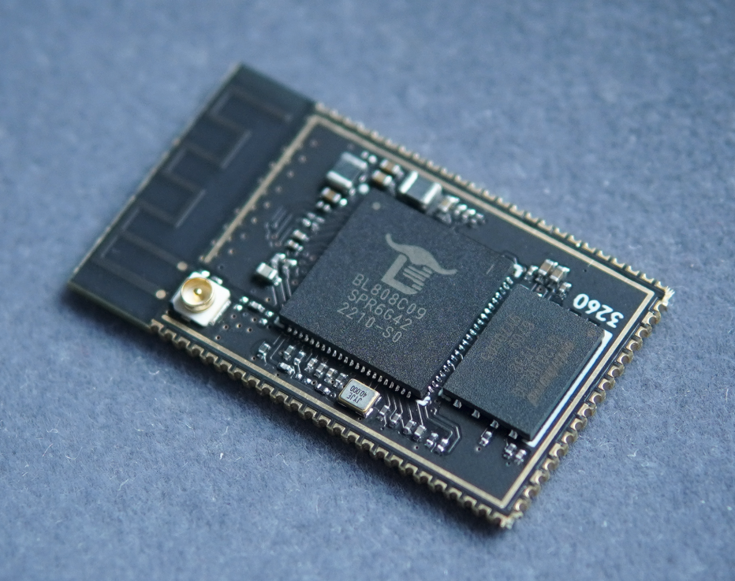
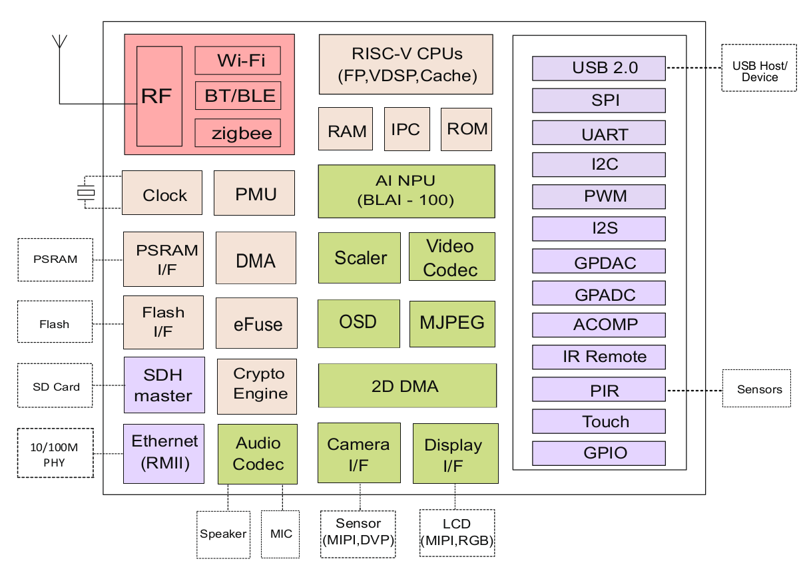

# 软件系统题
跨界AIoT芯片主线化

## 题目描述   
执此金秋佳节，Sipeed即将发布新款双跨界AIoT板卡 M1s CAM～  
为什么说是双跨界呢？因为它横跨 **RTOS** 与 **Linux** 两界，也横跨 **TinyML** 与 **AIoT** 两界。   

M1s CAM 基于[BL808](assets/BL808_DS_zh.pdf)芯片，多核异构（480M RV64 C906 + 320M RV32 E907 + 160M RV32 E902），  
外设上，M1s基本是"单片机"界的顶流配置：
1. 内存：内置64MB高速DDR3， 等效频率最高达2166M！秒杀现有IoT芯片的psram速率，甚至比全志常规内封的64MB DDR2更快～
2. 存储：板载16MB nor flash，支持 RTOS/Linux 启动～ 支持原生高速SDHC接口～
3. 通信：支持WiFi/BT/BLE/Zigbee 全系列无线通信功能～ 支持RMII百兆网络接口～
4. USB：支持USB2.0 HS! 高速480Mbps接口，支持主从～
5. 点屏：支持常规 MCU并口屏，RGB屏；第二封装支持MIPI屏～
6. 摄像头：同时支持 DVP/MIPI 摄像头接口，支持1080P H264编码～
7. Audio：支持多路 I2S/PDM/模拟 麦克风输入，支持立体声模拟输出～  

系统上，默认SDK基于**FreeRTOS**系统；  
由于大核采用的是平头哥玄铁C906内核，具备MMU以及足够的内存，所以它也能运行标准**Linux**内核～ 

算力上，由于C906具备 RVV 0.7.1指令集扩展，E907具备 RVP指令集扩展，所以它可以作为纯CPU运算的**TinyML**典型平台;  
由于BL808 内置 100GOPS 的小型NPU，又可以作为**AIoT**的入门级芯片，高速运行 mobilenetv1,v2等典型模型～

借此秋季挑战赛的机会，Sipeed向开源社区发布该芯片的主线化任务～

该题非竞赛性质，而是社区协作移植性质，成功移植后将会对主要参与者均发放奖励！   
考虑到有能力进行本题操作的用户基本为Linux社区开发者或RISC-V社区开发者，  
所以本题的完赛奖励为 最新款 高性能四核RISC-V Pad一台！性能秒RPi4！

本题的最低移植目标为：
1. 完成 uboot/oreboot 等主流boot移植
2. 完成主线内核移植，并启动openwrt系统
3. 完成基础驱动移植：GPIO,UART,SPI,IIC,WiFi

## 提交内容
参赛者请在2022.10.31前提交结果。   
需要投递简历的可以同时将简历投递至 support@sipeed.com, 标题为 "[秋季挑战赛]软件系统组 姓名"  

## 评比方法
按实际linux系统启动运行情况评审。

## 完赛记录
完赛者记录会在比赛期间及时更新到本节

